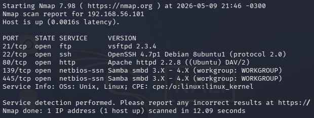
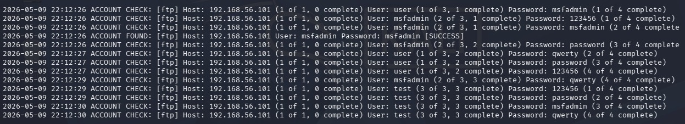

<div align="center">

# Desafio DIO - Kali Linux + Medusa + Metasploitable 2


</div>

---

# Sobre o Projeto

Este projeto foi desenvolvido como parte do desafio prático da DIO com foco em **Ethical Hacking**, utilizando o **Kali Linux**, a ferramenta **Medusa** e a máquina vulnerável **Metasploitable 2**.

O objetivo foi compreender, em ambiente controlado, como funcionam ataques de força bruta em diferentes serviços, incluindo:

- SMB
- FTP
- Formulários Web (DVWA)

Além da execução dos testes, também foram analisadas possíveis medidas de mitigação e boas práticas de segurança.

---

# Objetivos de Aprendizagem

 - Compreender ataques de força bruta  
 - Utilizar o Medusa em auditorias de segurança  
 - Trabalhar com ambientes vulneráveis  
 - Realizar enumeração de usuários  
 - Validar acessos comprometidos  
 - Documentar processos técnicos no GitHub  

---

# Configuração da Rede

As máquinas virtuais foram configuradas utilizando:

- VirtualBox
- Rede Host-Only

---

# Verificação de IP

## Metasploitable 2

```bash
ip addr
```

Resultado:

```bash
192.168.56.101
```

# Teste de Conectividade

Teste realizado com ping:

```bash
ping -c 3 192.168.56.101
```

Resultado do ping:

```bash
PING 192.268.56.101 (192.268.56.101) 56(84) bytes of data.
64 bytes from 192.268.56.101: icmo_sec=1 ttl=255 time 1.14 ms
64 bytes from 192.268.56.101: icmo_sec=1 ttl=255 time 1.78 ms
64 bytes from 192.268.56.101: icmo_sec=1 ttl=255 time 1.67 ms

— 192.268.56.101 ping statistics —
3 packets trasmitted, 3 received, 0% packet loss, time 2003ms
rtt min/avg/max/mdev = 1.139/1528/1.779/0.279 ms
```
---

# Escanear portas

Esse comando basicamente escaneia as portas 21, 22, 80, 445 e 139, portas muito comuns para FTP, SSH. HTTP e SMB.

```bash
nmap -sV -p 21,22,80,445,139 192.268.56.101
```

## Explicação dos parâmetros

| Parâmetro | Função |
|---|---|
| -sV | Host alvo |
| -p | porta |

---

Resultado obtido:



---

# Criação das Wordlists

## users.txt

```txt
msfadmin
admin
user
root
test
```

Exemplo:

```bash
echo -e "user\nmsfadmin\nadmin\nroot" > users.txt
```

## pass.txt

```txt
123456
password
admin
msfadmin
```


# Medusa - Ataque de Força Bruta 

```bash
medusa -h 192.168.56.101 -U users.txt -P pass.txt -M ftp -t 6
```

## Explicação dos parâmetros

| Parâmetro | Função |
|---|---|
| -h | Host alvo |
| -U | Lista de usuários |
| -P | Lista de senhas |
| -M | Serviço utilizado |

---

Resultado:



---

# Testes no DVWA

## Acesso ao DVWA

```txt
http://192.168.56.101/dvwa
```

Foram realizados testes simples de autenticação para compreender vulnerabilidades em formulários Web.


# Medidas de Mitigação

Os testes demonstraram como credenciais fracas representam riscos graves para sistemas corporativos.

## Recomendações

### Utilizar senhas fortes

- Senhas longas
- Caracteres especiais
- Evitar palavras comuns

### Implementar MFA

A autenticação multifator reduz drasticamente o risco de comprometimento.

### Bloqueio por tentativas

- Account lockout
- Rate limiting

### Monitoramento

- Logs de autenticação
- Alertas de comportamento suspeito

### Hardening

- Atualizações constantes
- Remoção de serviços inseguros
- Restrição de acessos internos

---

# Aprendizados Obtidos

Durante o desenvolvimento deste laboratório foi possível compreender:

- Funcionamento de ataques de força bruta
- Enumeração de usuários SMB
- Uso prático do Medusa
- Diferença entre brute force e password spraying
- Importância de senhas fortes
- Impacto de serviços mal configurados

O projeto também reforçou como ferramentas clássicas continuam relevantes mesmo com o crescimento de soluções modernas de segurança.

---

# Estrutura do Projeto

```txt
📁 desafio-medusa-dio
 ┣ 📄 README.md
 ┣ 📄 users.txt
 ┣ 📄 passwords.txt
 ┗ 📁 images
    ┣ 📷 Nmap-scan.jpeg
    ┣ 📷 Medusa-ftp.jpeg
```

---

# ⚠️ Aviso Legal

Este projeto foi desenvolvido exclusivamente para fins educacionais em ambiente controlado.

A utilização dessas técnicas sem autorização é ilegal.

---

# Autor

Projeto desenvolvido para o desafio da DIO.

Feito com foco em aprendizado prático de Cybersecurity 